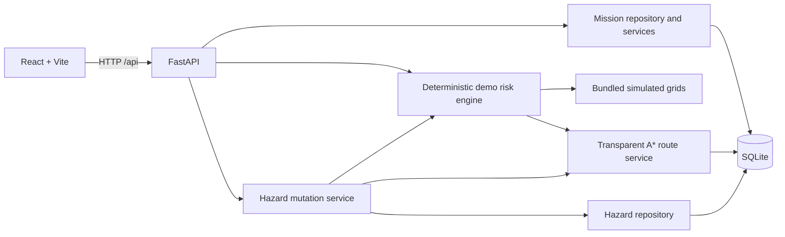
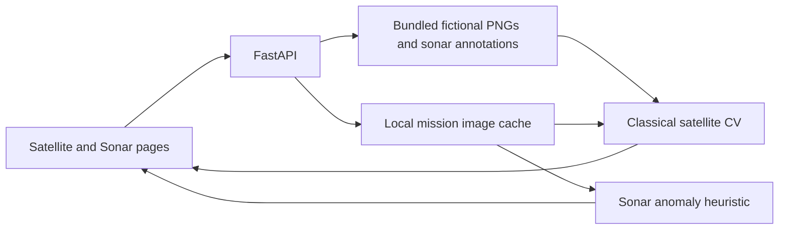
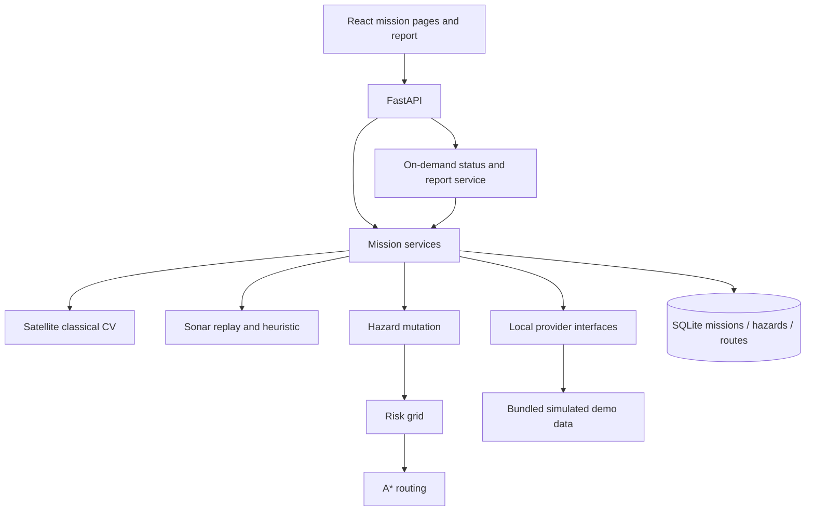

# Architecture

Missions and AOIs are stored in SQLite. Chunk 2's fictional Cyclone Varuna environment is versioned in `demo-data`; risk is recomputed deterministically and route comparisons are calculated with A*. The latest requested route result is stored in SQLite. The frontend uses an Axios client and Vite development proxy. Grid row/column coordinates are schematic and deliberately separate from EPSG:4326 AOIs, which will be used for real-data missions in a later chunk.

Chunk 3 persists the three seeded annotations and operator-entered hazards in a `hazards` table. `seed_demo` inserts the fixed seeded IDs only when absent, preserving resolved status on restart. The hazard service writes a mutation, rebuilds the risk grid, and, if a route plan exists, recomputes and stores both routes in one SQLite transaction. The existing `route_calculations` table retains endpoints and the latest result; new results also store route options in its JSON payload. Legacy route records without options use documented defaults. `Base.metadata.create_all` adds the new table to existing SQLite databases without replacing mission or route records; no existing column migration is needed.

## Scaffold Chunk A: offline imagery

`app.services.imagery` owns image validation, source selection, and detector interfaces. Demo assets are generated reproducibly by `scripts/generate_imagery_demo.py` and committed under `demo-data`. User uploads are normalized PNG files under `BLUE_CACHE_DIR/imagery/{mission_id}` and survive page reloads and server restarts on the same host. Image analysis does not write into mission or hazard tables. Satellite and sonar processing remain independent from hazard routing. The ML detector classes are explicit unavailable adapters.

## Final foundation seams and report

`backend/app/services/providers.py` defines small typed contracts for satellite pairs, ocean grids, bathymetry grids, and sonar replay. Local providers read the existing bundled data and expose source metadata. External satellite/ocean/bathymetry classes raise `NOT_CONFIGURED`; the application maps that to a structured 503 if invoked. No external network calls occur. The existing risk engine now loads local ocean and bathymetry through those providers without changing its formulas or the demo route baseline.

`backend/app/services/report.py` reads current SQLite state and calculates current risk and image summaries on request. It does not create historical report records. `/api/missions/{id}/system-status` provides the dashboard cards; `/report` provides the printable mission snapshot. Uploaded images remain in the configured local cache, while missions, hazards, and route plans remain in SQLite. Future GIS, real provider, and ML work points are listed separately in `docs/future-development.md`.
